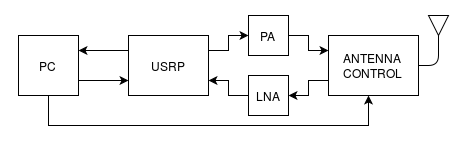
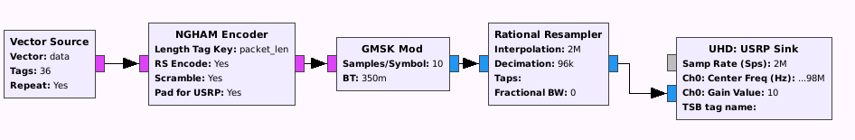
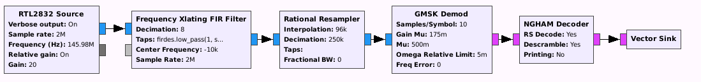

# Design review of the NUTS Ground Station

## Requirements table

| Code           | Description                                            |
| -------------- | ------------------------------------------------------ |
| R05-GS-NGH-001 | The ground station must send commands to the satellite |
| R02-GS-CW-001  | The ground station must decode the beacon signal       |
| R03-GS-NGH-002 | The ground station must process housekeeping data      |
| R04-GS-NGH-003 | The ground station must receive payload data from the  |
|                | satellite                                              |
| R06-GS-NGH-004 | The ground station must use FEC to prevent data        |
|                | corruption and loss                                    |

## System overview

The role of the ground station is to provide communication with the satellite for the duration of the mission. The communtication will take place on two different frequencies, VHF (145.98 MHz) and UHF (437.305 MHz), to give some flexibility with regards to noise and other communication. The data is encoded using the [NGHAM](https://github.com/skagmo/ngham) packet radio protocol developed by J. Skagmo, LA3JPA. 

The RF-frontend consists of an antenna with a PA for uplink and an LNA for downlink. This is connected to an USRP which performs filtering and mixing for basisband processing. The basisband signal processing and encoding/decoding is done by a computer running GNURadio. An example top level design is shown below.

### GNU Radio (v3.7.8)

GNU Radio is a free software development toolkit that provides signal procesing blocks to implement SDRs and signal processing systems. It communicates with the hardware over ethernet using raw I/Q samples. These samples are processed using module blocks written in either Python or C++, and converted to and from a meaningful bitstream of data. 

The blocks used in this system include:

- GMSK Mod/Demod: Converts between I/Q symbols and bits
- NGHAM Encode/Decode: Converts between data bits and encoded data bits, the encoded bits include the data bits as well as CRC bits and Reed-Solomon bits used for Forward Error Correction
- Frequency Xlating FIR Filter: Multi-purpose filter for shifting the signal in the frequency domain, also works as a low pass filter.
- Rational resampler: Changes the sampling rate of the datastream.
- UHD USRP Sink: Hardware driver for USRP
- RTL2832 Source: Hardware driver for RTL-SDR dongle used for testing (Will be replaced with UHD USRP Source)

These figures are screenshots from the GNU Radio Companion, a graphical tool used to generate flowgraphs. The top one shows a simple implementation of the uplink design and the bottom one shows the downlink design. 

The vector source and sink would be replaced with other blocks for sending commands and processing received data. UDP may be the best solution for this, as is is already a part of GNU Radio.

### USRP

The USRP is a Software Defined Radio meaning that the usual components of a radio (mixers, filters, amps, etc.) are all implemented in software. The USRP has an FPGA which converts real analog signals to complex baseband signals in the digital domain. These are transferred to the host computer running GNU Radio via an ethernet cable.

It should have a frontend allowing multiple antenna inputs for circularly polarized signals.

### RF-Frontend

- LNA/PA
- Antenna: circultarly polarized

### Gpredict

used for calculating pass times and positions to control the antenna, also doppler shift which must be corrected by the ground station

## What is done

- The NGHAM encoder block is complete and decoder block is almost done (at the time of writing).
- Communication between USRP and the OWL VHF radio module is successful, and messages of different lengths decode correctly. Communicating with UHF radio module should be trivial (?).

## TODO

- Finish NGHAM decoder block!
- Handle errors in the non-FEC encoded parts of the packet (preamble, sync word and size tag)
- Find a way to handle doppler shifts
    - currently this is calculated by the HAM radio 
    - one possible way is to run the decoder on an interval of frequencies, like a gps receiver does
    - another is to find out how to use the Clock Recovery MM block in a clever way (it is integrated in the GMSK Demod block, but it may not work for large frequency offsets)
- cw signal, useful blocks probably already exist in GNU Radio

## Abbreviations

- CW: Continous wave
- FEC: Forward Error Correction
- GS: Ground Station
- I/Q: In-phase/Quadrature
- LNA: Low Noise Amplifier
- NGH/NGHAM: Next Generation Ham
- PA: Power Amplifier
- RF: Radio Frequency
- RS: Reed-Solomon
- SDR: Software Defined Radio
- UHF: Ultra high frequency
- USRP: Universal Soft Radio Peripheral
- VHF: Very high frequency
